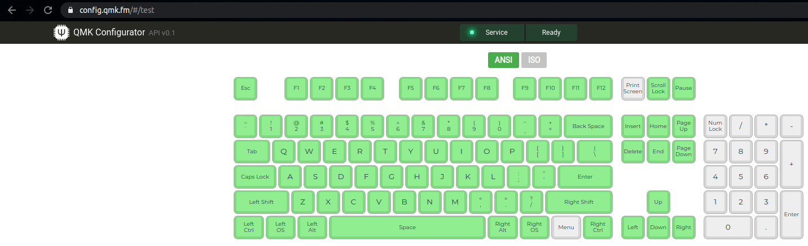

### Expected hardware

- Keyboard: [Mysterium v2](https://github.com/coseyfannitutti/mysterium)

- Computer for compilation / upload / testing of the keyboard: Ubuntu 18.04

- USBasp programmer, which Han had updated the firmware of to
  `usbasp.atmega8.2011-05-28.hex`, as per his guide.


### Installing dependencies

On a Ubuntu 18.04 computer:

```
sudo apt update
sudo apt install avrdude git libhidapi-hidraw0 libusb-dev
```

You must also have `python3.8` and `python3.8-venv` installed. They are available in the
`deadsnakes` PPA if you need to install them. `python3.7` should also work.


### Setting up this fork of QMK

```
cd ~/src
git clone https://github.com/tom-f-oconnell/qmk_firmware

# (assuming you have python3.8 installed; get from deadsnakes PPA w/ venv if not)
python3.8 -m venv venv
source venv/bin/activate
pip install --upgrade pip
pip install qmk

qmk setup -H ~/src/qmk_firwmare
```


### Flashing bootloader on the ATmega32A

Connect the USBasp ISP connector to the corresponding connector on the keyboard. Orient
the connectors such that the ground pins line up. There is no apparent need to connect
the USB-C cable at this point, though it also didn't seem to hurt.

There does not seem to be any need to press the RESET and BOOT buttons, though they
might matter for subsequent programming over USB (see the Mysterium flashing guide for
more info here). Initial programming of blank chips must still be done with a
programmer.

USBasp jumper congifuration:
- 2-pin jumper: open
- 3-pin 3.3/5v selector: 5v (ATmega32A seems like it might also work with 3.3v)

```
# This directory should contain the .hex file referenced in the next command
cd ~/src/qmk_firmware/util

# Note that the -B4 flag seemed critical in my case
avrdude -c usbasp -v -p m32 -P usb -e -U flash:w:bootloader_ps2avrgb_bootloadhid_1.0.1.hex:i -U hfuse:w:0xD0:m -U lfuse:w:0x0F:m -B4
```


### Uploading the QMK firmware

Leave the USBasp programmer connected to the keyboard via the ISP pins.

```
cd ~/src/qmk_firmware

# Activate the virtual environment created in a previous step
source venv/bin/activate

# A corresponding `qmk compile` command might have been needed before this, but I
# doubt it.
qmk flash -kb coseyfannitutti/mysterium -km default
```


### Testing the keyboard

Disconnect the ISP connector and connect the keyboard to your 18.04 computer via USB-C.

You should see some lines appear at the end of `dmesg` output that look like:
```
[ 7812.525212] usb 1-6: new low-speed USB device number 98 using xhci_hcd
[ 7812.756487] usb 1-6: New USB device found, idVendor=6b62, idProduct=8769, bcdDevice= 0.01
[ 7812.756493] usb 1-6: New USB device strings: Mfr=1, Product=2, SerialNumber=0
[ 7812.756496] usb 1-6: Product: MYSTERIUM
[ 7812.756499] usb 1-6: Manufacturer: coseyfannitutti
[ 7812.792599] input: coseyfannitutti MYSTERIUM as /devices/pci0000:00/0000:00:14.0/usb1/1-6/1-6:1.0/0003:6B62:8769.0016/input/input52
[ 7812.853931] hid-generic 0003:6B62:8769.0016: input,hidraw6: USB HID v1.01 Keyboard [coseyfannitutti MYSTERIUM] on usb-0000:00:14.0-6/input0
[ 7812.870612] input: coseyfannitutti MYSTERIUM System Control as /devices/pci0000:00/0000:00:14.0/usb1/1-6/1-6:1.1/0003:6B62:8769.0017/input/input53
[ 7812.929540] input: coseyfannitutti MYSTERIUM Consumer Control as /devices/pci0000:00/0000:00:14.0/usb1/1-6/1-6:1.1/0003:6B62:8769.0017/input/input54
[ 7812.929949] hid-generic 0003:6B62:8769.0017: input,hidraw7: USB HID v1.01 Device [coseyfannitutti MYSTERIUM] on usb-0000:00:14.0-6/input1
```

Use the online QMK keyboard tester [here](https://config.qmk.fm/#/test). With my first
test of the mysterium, using a single unsoldered keyboard switch to test everything, I
got this output:



### Information on alternate keymaps / layouts

Information on keymaps:
```
(venv) tom@blackbox:~/src/qmk_firmware$ qmk list-keymaps -kb coseyfannitutti/mysterium 
ansi_7u
brandonschlack
default
iso
talljoe-tkl
via
xyverz
yanfali
```

Information on layouts:
```
(venv) tom@blackbox:~/src/qmk_firmware$ qmk info -kb coseyfannitutti/mysterium
Keyboard Name: MYSTERIUM
Manufacturer: coseyfannitutti
Website: https://github.com/coseyfannitutti/mysterium
Maintainer: coseyfannitutti
Keyboard Folder: coseyfannitutti/mysterium
Layouts: LAYOUT_tkl_ansi, LAYOUT_tkl_ansi_7u, LAYOUT_tkl_iso, LAYOUT_tkl_iso_7u
Size: 18.25 x 6.25
Processor: atmega32a
Bootloader: USBasp
```

I forget if I explicitly configured the bootloader at one point, such that it is showing
up at `USBasp` in the output of the command above.


### More information

See the [upstream of this fork](https://github.com/qmk/qmk_firmware) for more
documentation.

